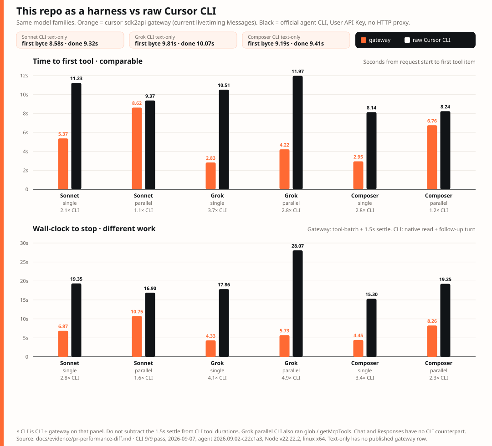
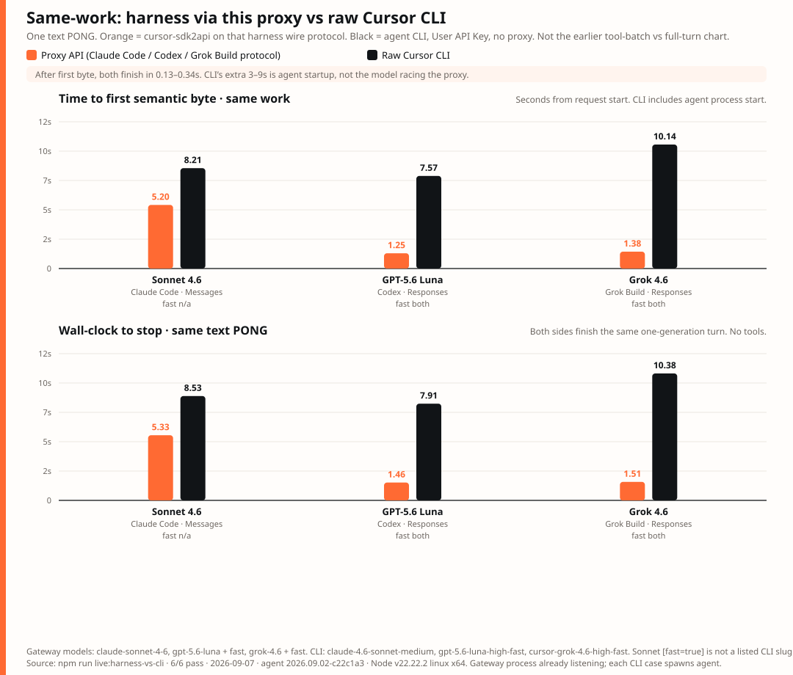
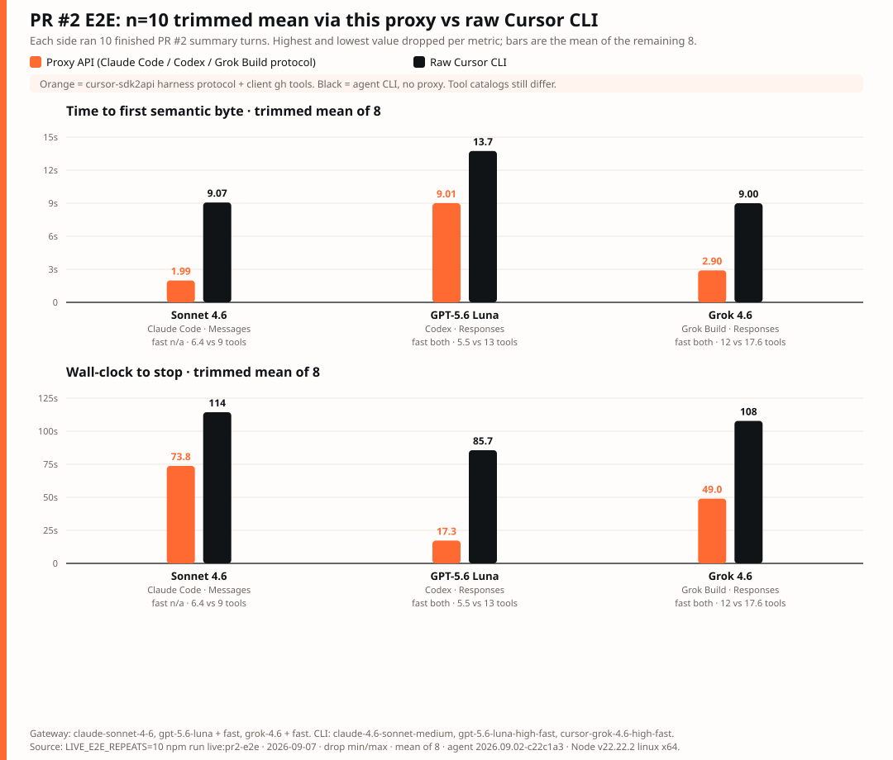

# Performance diff

Same 11-case `live:timing` suite, `TOOL_BATCH_SETTLE_MS=1500`, idle off. Before early tool streaming (`@cursor/sdk` 1.0.30) vs current (1.0.31). Both 11/11.

**`tool_lead_ms`** is the effect: first streamed tool item → stop. Duration still includes generation and the same 1.5 s settle.

| Case | First tool before → current | Tool lead | Duration |
|---|---:|---:|---:|
| Sonnet Messages single | 7.08s → 5.37s | 0 → **1503 ms** | 7.08s → 6.87s |
| Sonnet Messages parallel | 6.78s → 8.62s | 0 → **2138 ms** | 6.78s → 10.75s |
| Grok Messages single | 33.47s → 2.83s | 0 → **1502 ms** | 33.47s → 4.33s |
| Grok Messages parallel | 5.87s → 4.22s | 0 → **1502 ms** | 5.87s → 5.73s |
| Composer Messages single | 3.84s → 2.95s | 0 → **1501 ms** | 3.84s → 4.45s |
| Composer Messages parallel | 4.46s → 6.76s | 0 → **1501 ms** | 4.46s → 8.26s |
| Sonnet Chat parallel | 6.00s → 5.65s | 0 → **2450 ms** | 6.00s → 8.10s |
| Sonnet Responses parallel | 6.48s → 3.55s | 0 → **2055 ms** | 6.48s → 5.61s |

Before, tools land only in `finish()` (`tool_lead=0`, parallel items as one clump). Current writes each item at `execute()`. Text SSE is unchanged. Duration deltas are generation. `batch_close_wait_ms` on current was 1500–1503 ms every tool case. Grok single on the before side sat 33.5 s before the tool clump — generation, not close policy.

| Client | Per round | 30 rounds |
|---|---|---|
| Starts on the tool item (Codex `output_item.done`) | **1.5 s earlier** (~**2.1–2.5 s** on Sonnet parallel) | Up to ~45 s of tool work overlapped with the wait, if the tools take that long |
| Waits for stop (typical Claude Code) | Tools visible 1.5 s earlier; **round wall-clock unchanged** | **0 s** of settle removed |

`TOOL_BATCH_IDLE_MS=300` (off by default) is the only setting that shortens stop wait (~1.2 s/round); Sonnet parallel batches can split. Settle exists because the SDK still has no generation-end event before local tools run; see Architecture.

## Cursor CLI direct-key baseline

Same three `live:timing` model families, measured on official Cursor CLI (`agent` `2026.09.02-c22c1a3`, `-p --output-format stream-json --stream-partial-output`) with a User API Key and **no** HTTP gateway. Window: 2026-09-07, Node `v22.22.2`, linux x64, 9/9 pass. Re-run with `CURSOR_LIVE_SMOKE=1 npm run live:cli-timing`.

CLI catalog slugs are not the gateway ids. The runner maps them and records both:

| Gateway / live:timing id | CLI `--model` |
|---|---|
| `claude-sonnet-4-6` | `claude-4.6-sonnet-medium` |
| `grok-4.6` | `cursor-grok-4.6-medium` |
| `composer-2.5` | `composer-2.5` |

This is the generation/harness floor the gateway numbers sit on. CLI has no Messages / Chat / Responses split. Text uses `--mode ask`. Tool cases use CLI-native file reads against isolated marker files, not `live_alpha` / `live_beta`. `tool_lead_ms` here is first native tool start → CLI `result` (tool exec + follow-up generation). It is **not** the gateway 1.5 s settle. Gateway `live:timing` tool rows stop when the first tool batch is published; they do not run the tools or a second model turn.

**Do not use this chart as “proxy vs native.”** Orange here is `live:timing` stopping at the first tool batch plus the 1.5 s settle. Black is a finished Cursor CLI agent turn. The proxy is an extra HTTP layer; it cannot be faster at the same work because of that chart. The peach chips are CLI text-only and have no gateway text row. Use the same-work section below.

## Same-work harness protocol vs Cursor CLI

Orange **is** this repo’s proxy speaking the harness wire protocol (not a spawned Claude Code / Codex / Grok Build binary). Black **is** official Cursor CLI (`agent`) with the User API Key and no HTTP proxy.

| Pair | Proxy path | Proxy model | CLI model | Fast |
|---|---|---|---|---|
| Sonnet 4.6 | Claude Code `POST /v1/messages` | `claude-sonnet-4-6` | `claude-4.6-sonnet-medium` | not advertised on either catalog; CLI `[fast=true]` exits 1 |
| GPT-5.6 Luna | Codex `POST /v1/responses` | `gpt-5.6-luna` + `fast=true` | `gpt-5.6-luna-high-fast` | both |
| Grok 4.6 | Grok Build `POST /v1/responses` | `grok-4.6` + `fast=true` | `cursor-grok-4.6-high-fast` | both |

Same user turn: stream a text PONG to stop. No tools. Gateway process already listening; each CLI case spawns `agent`. Re-run with `CURSOR_LIVE_SMOKE=1 npm run live:harness-vs-cli`. Window: 2026-09-07, 6/6 pass.

| Pair | Proxy first byte | CLI first byte | Proxy duration | CLI duration | After first byte |
|---|---:|---:|---:|---:|---|
| Sonnet 4.6 | 5.20s | 8.21s | 5.33s | 8.53s | 0.13s vs 0.32s |
| Luna fast | 1.25s | 7.57s | 1.46s | 7.91s | 0.21s vs 0.34s |
| Grok 4.6 fast | 1.38s | 10.14s | 1.51s | 10.38s | 0.13s vs 0.24s |

The proxy is not beating the model. After the first semantic byte both sides finish in 0.13–0.34 s. CLI’s extra 3–9 s is `agent` startup (sandbox, stream-json, system init) on every spawn. The gateway paid that once when the child process came up. A Claude Code / Codex / Grok Build **binary** pointed at this proxy would add its own startup on top of the orange bars.

## Same-work end-to-end: summarize PR #2

Same three pairs and fast-mode mapping as the PONG section. The user turn is now a finished agent task: inspect GitHub pull request #2 of this repo and write a summary report to stdout, without creating or editing files.

| Side | How the work runs |
|---|---|
| Orange / proxy | This gateway speaking the harness wire protocol, plus a **client** tool loop (`pr_metadata`, `pr_files`, `pr_diff`, `read_repo_file`) that shells `gh` / reads the repo |
| Black / CLI | Official `agent -p --force --sandbox disabled --workspace <repo>` with native tools. No HTTP proxy |

This is the whole process: first semantic byte, first tool, tool rounds, generation of the report, and stop. It is not the one-word PONG and it is not `live:timing` stopping at the first tool batch. Re-run with `CURSOR_LIVE_SMOKE=1 npm run live:pr2-e2e`. Receipts keep timings, tool names, and `report_chars` only. Window: 2026-09-07, 6/6 pass.

| Pair | Proxy first byte | CLI first byte | Proxy duration | CLI duration | Tools (proxy / CLI) | Proxy rounds | Report chars |
|---|---:|---:|---:|---:|---:|---:|---:|
| Sonnet 4.6 | 3.68s | 11.46s | 99.0s | 110.4s | 9 / 8 | 6 | 6959 / 7604 |
| Luna fast | 1.50s | 8.26s | 14.9s | 75.4s | 7 / 19 | 3 | 1156 / 1697 |
| Grok 4.6 fast | 23.37s | 10.73s | 100.8s | 108.8s | 14 / 18 | 6 | 5701 / 5407 |

The tool catalogs are not identical. Orange executes four client inspect tools (`pr_metadata`, `pr_files`, `pr_diff`, `read_repo_file`). Black uses CLI-native `shell` / `read` / `glob` / `mcp`. Luna’s 15 s vs 75 s is mostly that: 7 inspect calls versus 19 CLI tools, not the proxy beating the model. Sonnet and Grok wall clocks landed within ~10 s of each other after a finished report.

Grok’s first semantic byte was **slower** through the already-listening proxy (23.4 s) than through a freshly spawned `agent` (10.7 s). That is generation, not process start. CLI still paid ~8 s before first byte on Luna, matching the PONG startup floor.

Do not subtract the 1.5 s gateway settle from these rows. Both sides ran tools and produced a report. A Claude Code / Codex / Grok Build **binary** pointed at this proxy would add its own startup on top of orange.

Receipt fields match `live:timing` where they exist: `first_byte_ms` (first thinking or assistant delta), `first_tool_ms`, `tool_lead_ms`, `duration_ms`. The machine JSON stays outside git.

| Case | First byte | First tool | Tool lead | Duration | Result |
|---|---:|---:|---:|---:|---|
| Sonnet CLI text | 8.58s | — | — | 9.32s | pass |
| Sonnet CLI single | 19.00s | 11.23s | **7914 ms** | 19.35s | pass |
| Sonnet CLI parallel | 16.66s | 9.37s | **7363 ms** | 16.90s | pass |
| Grok CLI text | 9.81s | — | — | 10.07s | pass |
| Grok CLI single | 9.30s | 10.51s | **7178 ms** | 17.86s | pass |
| Grok CLI parallel | 10.48s | 11.97s | **15824 ms** | 28.07s | pass |
| Composer CLI text | 9.19s | — | — | 9.41s | pass |
| Composer CLI single | 8.14s | 8.14s | **6972 ms** | 15.30s | pass |
| Composer CLI parallel | 8.24s | 8.24s | **10836 ms** | 19.25s | pass |

Sonnet tool turns streamed the file `read` before any thinking/text (`first_tool` < `first_byte`). Composer started both in the same ~10 ms window. Grok parallel selected two `read`s and also `glob` / `getMcpTools` (spread 8.66 s); treat that extra tool work as model-nondeterministic, not a CLI scheduler claim.

Text is the only same-shaped comparison: one generation, no tools. CLI first byte was 8.6–9.8 s and wall clock 9.3–10.1 s across the three families. Do not subtract the gateway 1.5 s settle from these CLI tool durations; the CLI paid a full agent turn.

Chat and Responses rows in the gateway table have no CLI counterpart.
